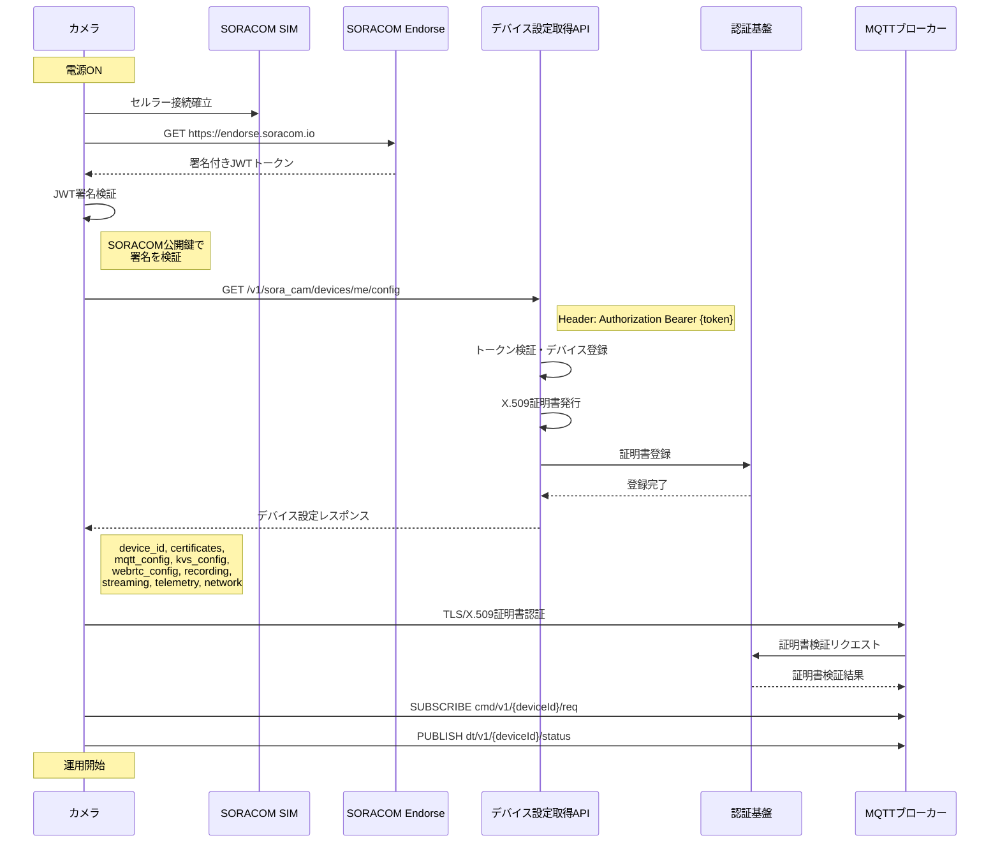

# デバイスプロビジョニング機能

## 全体概要

カメラデバイスの初期設定から運用開始までの自動プロビジョニング処理。SORACOM Endorseによる認証からMQTTブローカーへの接続確立まで、サーバとデバイスが連携して実行する。

### 処理フロー全体像

## 関連API
- REST: `GET https://endorse.soracom.io` - SORACOM Endorseトークン取得
- REST: `GET /v1/sora_cam/devices/me/config` - デバイス設定取得 (→ [04_api_specs/rest/provisioning-api.yaml](../04_api_specs/rest/provisioning-api.yaml))
- MQTT: `cmd/v1/{deviceId}/*`, `dt/v1/{deviceId}/*` トピック (→ [04_api_specs/mqtt/soracam-mqtt-api.yaml](../04_api_specs/mqtt/soracam-mqtt-api.yaml))

## デバイス側処理

### 処理概要
1. **セルラー接続**: SORACOM SIMでネットワーク接続
2. **Endorse認証**: SIM認証によるトークン取得（シームレスなデバイス登録）
3. **デバイス設定取得**: 運用に必要な設定情報を取得（MQTT/KVS/WebRTC設定、録画・配信・テレメトリ・ネットワーク設定）
4. **設定情報保存**: 取得した設定情報を安全なストレージに保存
5. **MQTT接続**: 取得したX.509証明書でMQTTブローカーに接続

## サーバ側処理

### 処理概要
1. **認証トークン検証**: デバイスJWTトークンを検証しデバイスID取得
2. **X.509証明書発行**: デバイス固有のクライアント証明書と秘密鍵を生成
3. **認証基盤登録**: 発行した証明書を認証基盤（AWS IoT Core等）に登録
4. **設定情報取得**: データベースからデバイス固有の設定情報を取得
5. **レスポンス送信**: デバイスが必要とする設定情報を返却（証明書、MQTT/KVS/WebRTC設定、録画・配信・テレメトリ・ネットワーク設定）

### データ設計

データベース設計の詳細については、別ドキュメントを参照：
- [デバイス管理データベース設計](../../05_database/01_device_management.md)

## 統合・連携

### 通信詳細

API仕様の詳細については、別ドキュメントを参照：
- [デバイス設定取得API仕様](../04_api_specs/rest/provisioning-api.yaml) - `GET /v1/sora_cam/devices/me/config`

## 関連ドキュメント

- [AWS KVSへの映像アップロード機能](02b_kvs_upload.md)
- [ライブ映像・SDカード映像のブラウザ視聴機能](02a_browser_streaming.md)
- [X.509証明書管理・ローテーション](05_certificate_management.md)

## 課題
- デバイス設定取得API のレスポンスによって、即時映像配信等を始める機能の追加が必要かもしれない
- MQTTを使う前提でいるが、WebSocket の代替手段を検討する可能性がある
- 起動後、デバイスがオンラインになったかどうかを確認するための軽量のヘルスチェックAPIを用意するかもしれない
- デバイス設定取得API のレスポンス形式について確定する
- デバイス側の証明書のローテーション方法を検討する
